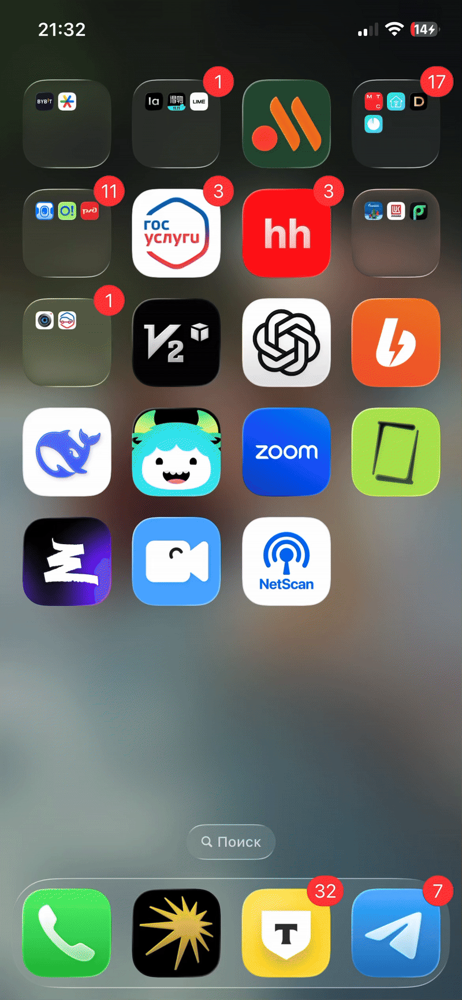

📡 NetworkScannerApp

Тестовое задание iOS-разработчика

NetworkScannerApp — приложение для сканирования устройств в локальной сети через Bluetooth и LAN, с сохранением результатов и историей сканирований.
Приложение создано в рамках тестового задания. Архитектура выстроена так, чтобы код был легко расширяемым и удобным для поддержки.

### Демонстрация

✨ Основные возможности
	•	🔍 Сканирование Bluetooth-устройств
	•	🌐 Сканирование LAN-устройств в локальной сети
	•	💾 Сохранение результатов в локальную базу данных (Realm)
	•	🕒 История сканирований
	•	📄 Просмотр устройств конкретной сессии
	•	⚠️ Системные уведомления о выключенном Bluetooth / Wi-Fi
	•	📱 Современный UI, адаптированный под iOS 15+

⸻

🧱 Архитектура проекта

Проект построен по принципам MVVM + Services, с использованием DI контейнера FactoryKit.

🛠 Используемые технологии
	•	SwiftUI — интерфейс
	•	Combine — реактивные биндинги
	•	RealmSwift — локальная база данных
	•	FactoryKit — dependency injection
	•	CoreBluetooth + LAN scanning — работа с устройствами
  
⸻

💾 Хранение данных

Для хранения истории используется Realm.

Что сохраняется:
	•	Дата начала и завершения сканирования
	•	Найденные Bluetooth-устройства
	•	Найденные LAN-устройства
	•	UUID, RSSI, MAC, Hostname, IP и т. д.

Преобразование моделей

Приложение использует отдельные DTO для UI и хранилища
(RScanSession, RDevice → ScanSession, BluetoothDevice, LanDevice).
